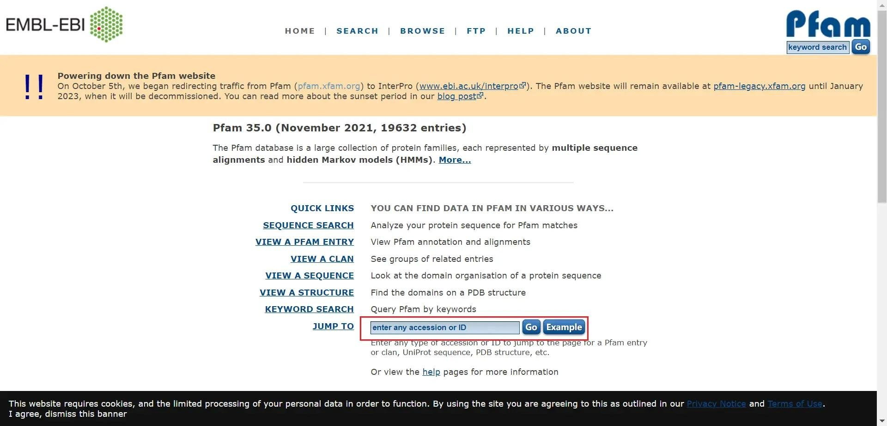
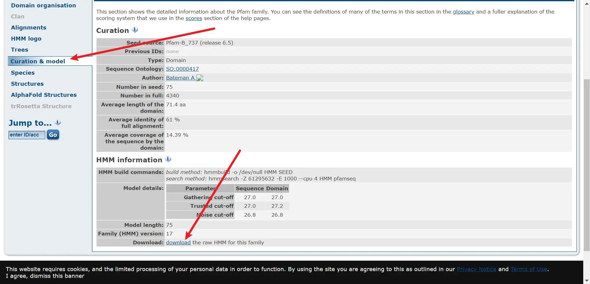

使用 HMMER 查找同源基因比 blast 更加准确，速度也更快，但使用方法很少有文章讲清楚，本文记录我使用 HMMER 的操作。

## HMMER

HMMER 是基于隐马尔可夫模型，用于生物序列分析工作的一个非常强大的软件包，它的一般用途是识别同源蛋白或核苷酸序列和进行序列比对。与 BLAST、FASTA 等序列比对和数据库搜索工具相比，HMMER 更准确

从功能基因研究的角度来讲，相关的搜索，比如从序列数据库中找同源序列，或者对一个新基因功能进行鉴定，使用 HMMER 比使用 blast 更有灵敏度且速度更快，但其应用远没有 blast 普及。

## 所需工具

Linux 系统环境、HMMER 软件、pfam 网站（http://pfam-legacy.xfam.org/）

## 下载隐马尔科夫模型

我以拟南芥的 SBP 家族为例
打开 [pfam](http://pfam-legacy.xfam.org/)，输入基因家族的 pf 号点击 go 进行查询



也可以通过关键字查询。

查询后点击左侧的 Curation & model 下载 .hmm 文件，Alignments 选择 stockholm 并生成 txt 文件。



## 安装 HMMER

建议使用 conda 安装：

```bash
# 创建并激活 Python 环境，然后安装 hmmer
conda create -n bioinfo python=3.7 -y
conda activate bioinfo
conda install hmmer -y
```

## 构建 HMM 模型

在工作目录下执行：
```bash
hmmbuild xxx.hmm xxx.txt
```

## 进行比对

在工作目录下执行：
```bash
hmmsearch model.hmm target_sequences.fa > result.out
```

结果查看：
```bash
cat result.out
```

## 进一步筛选

可以结合 NCBI、TBtools 等工具进一步筛选，并用 MEME、CDD 等方法鉴定，排除假阳性。